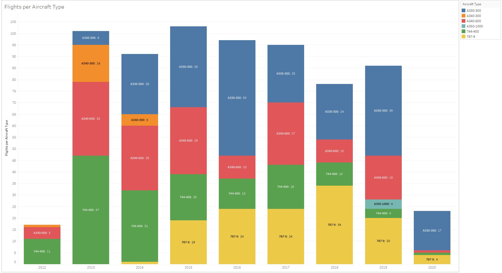
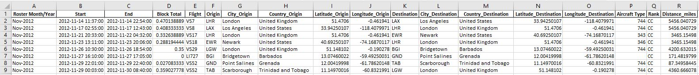

# FlightHistory
Seven years of flight data are provided for a Virgin Atlantic crew member, with detailed scheduling information for 700 flights worldwide. Data spanning Oct 2012 - Oct 2019 are provided in a series of Excel files ("Historical Crew Data"). More recent flight data (up to end-March 2020) is parsed from an iCalendar (.iCal) file. The data sets are combined along with additional geographical information, including airport lat/long, and distances calculated between origin/destination airports.

The final time-series data set (flight_history_combined.xlsx) allows us to filter and categorise data on aircraft type, airport code, city, country, distance, flight time, shifts/blocks and roster periods. 

Interactive plots published on Tableau Public: https://public.tableau.com/profile/alan.wilson7526#!/

Please feel free to re-use the data set and workflow for training.

Examples:

