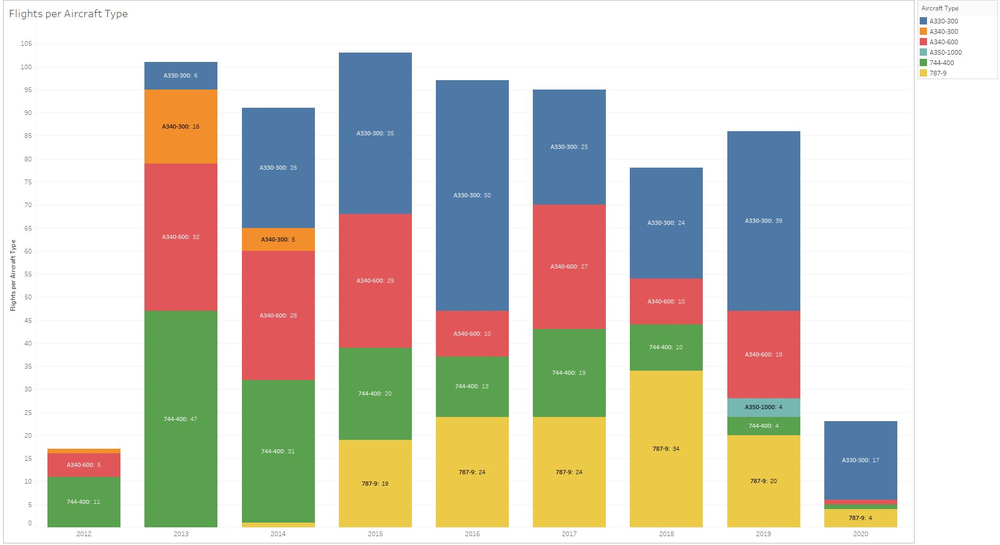

# FlightHistory

Looking for a good data set to play with in Tableau, I got a hold of my partner's flight history as Cabin Crew for Virgin Atlantic. It's a fascinating data set with details of 700 international flights over seven years.

### Data preparation
The data is provided in two parts. First, data spanning Oct 2012 - Oct 2019 are provided in a series of Excel files ("Historical Crew Data"). Second, more recent flight data (up to end-March 2020) is parsed from an iCalendar (.iCal) file. The data sets are combined along with additional geographical information, including airport lat/long, and distances calculated between origin/destination airports.

The final time-series data set (output to 'flight_history_combined.xlsx') allows us to filter and categorise data on aircraft type, airport code, city, country, distance, flight time, shifts/blocks and roster periods.

### Data vizualisation
Interactive plots published on Tableau Public: https://public.tableau.com/profile/alan.wilson7526#!/

Examples:

